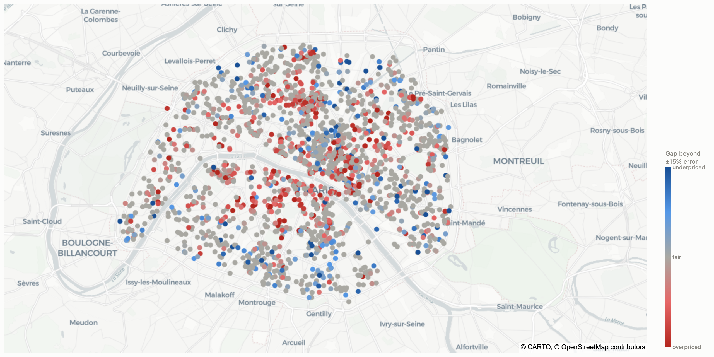
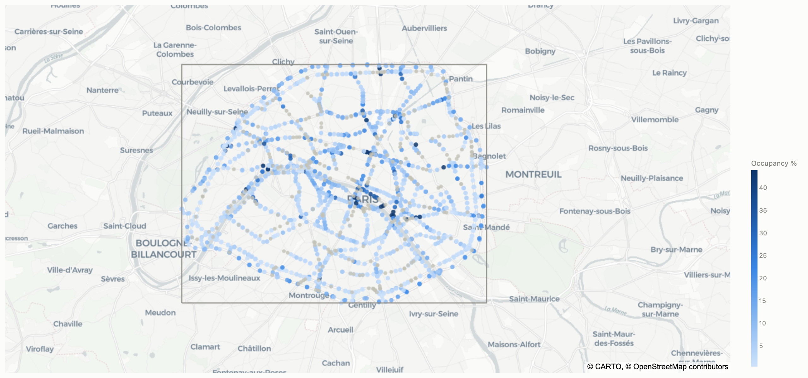
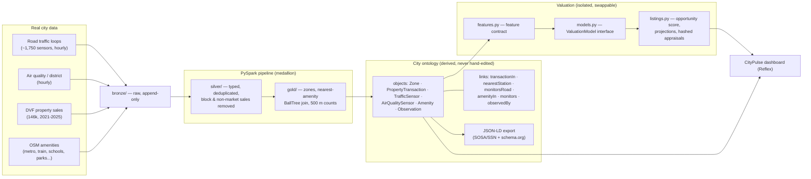

# CityPulse — Paris property tokenization on live smart-city data

CityPulse values every home in Paris from what the city itself measures.
Five real data sources — 1,750+ road-traffic induction loops, per-district
air quality, 146,000+ official property sales (DVF), and 4,500+
OpenStreetMap amenities (metro, train/RER, schools, parks, shops) — are
ingested into a medallion lakehouse, refined with **PySpark**, and
materialized into a **city ontology**: typed objects and links derived
entirely from the data. An **explainable valuation engine** reads features
straight off that graph, and a **Reflex** dashboard turns it into a usable
product: a property map, a sortable market table, and a full investment
dossier for every home.

The architecture deliberately mirrors enterprise smart-city platforms
(e.g. Palantir Foundry): lightweight connectors land raw data, Spark
pipelines refine it, an ontology turns tables into a semantic graph, and
applications consume the graph.



## The dashboard

| Page | What it does |
|---|---|
| **Doc** | The project overview for a first-time visitor: the smart-city stack, the tokenization lifecycle, and what each page shows. |
| **Properties** | Map + sortable table of 2,213 real Paris addresses with asking price, model fair value and value gap. Filter by zone, arrondissement, type, price band, rooms, and distance to school, metro, train/RER and park. Click any home for its **dossier**: value drivers in plain language, nearest school/metro/RER/park with walking times, live traffic and air quality for its zone, zone price trend, opportunity score breakdown, and bear/base/bull 3-year projections. |
| **Tokens** | The block explorer: every tokenized property with its deed, share supply, last price and market value; cap tables; and the feed of mints, appraisals, offers and trades. |
| **Data sources** | The data catalog: every feed with its provider, licence, cadence, coverage (records, zones, extent, freshness) and exactly which valuation features and ontology objects it feeds. Click any individual sensor to see its reading history. |
| **Ontology** | Object and link counts, an entity resolver that follows every link type, and a zone traversal (sales, sensors, amenities, air quality, hourly traffic). |
| **Appraise** | Price any surface/rooms/type in any zone, with the per-driver breakdown. |





## Why an ontology, and why derived?

A city integrates heterogeneous feeds. Tables answer "what rows exist"; an
ontology answers "**what things exist and how they relate**": *this sale sits
in this district, 202 m from this metro station, in a zone monitored by 187
road sensors whose readings say traffic is fluid, and where the air is Fair.*
The key design decision: the graph is **never hand-maintained** —
`src/smartcity/ontology/schema.yml` declares the model and a build step
hydrates it from the gold datasets, so re-running the pipeline updates the
graph. The graph exports to JSON-LD in standard vocabularies — W3C
**SOSA/SSN** for sensing (the basis of NGSI-LD and SAREF4City) and
**schema.org** for places and sales.

## Valuation: explainable by construction

`src/smartcity/valuation/` keeps three concerns apart:

- **`features.py` — the feature contract.** Distance to the nearest metro,
  train/RER, school and park; school/park/shop counts within 500 m; the
  zone's road-traffic occupancy and air quality; surface, rooms, zone.
  Every feature is a graph traversal, so every estimate is traceable.
- **`models.py` — the ML, behind one interface.** `ValuationModel`
  (fit / predict / explain / save / load) plus a registry; today a
  comparables baseline and a hedonic ridge regression on log €/m². Swapping
  in gradient boosting, a GNN over the ontology, or an external oracle is
  one class + one registry line.
- **`listings.py` — the investment layer.** Value gap vs the model's error
  band, a transparent 0–100 opportunity score (price vs fair value 35%, zone
  momentum 25%, metro/train access 20%, schools/parks/shops 10%,
  traffic/air 10%), 3-year bear/base/bull projections, and a sha256-hashed
  appraisal per property.

**Honest evaluation.** Time-based split: trained on sales ≤2024, tested on
28,958 unseen 2025 sales. Hedonic ridge: median absolute error **15.0%**
(comparables baseline: 15.7%); the shipped artifact is then refit on all
data. DVF carries no floor, condition or build year, which bounds any model.

**Data-quality decisions worth asking about.**
- DVF repeats one block-sale price on every unit of the block, so only
  single-dwelling mutations are kept (12,366 rows removed).
- Recorded prices more than 40% from fair value are treated as non-market
  transfers (family sales, viager), not bargains.
- Appraisals are stated as of the latest data month — the model's time
  trend is never extrapolated past its training window.
- Inventory = recent real sales (address, surface, rooms, recorded price
  shown as asking), stratified by arrondissement, plus every house.

## Tokenization: properties on-chain, valuations as oracles

The "beyond smart city" layer: top-graded properties from the valued
inventory are issued as on-chain assets on a local EVM chain (Anvil), with
the valuation engine acting as the price oracle. Five compact Solidity 0.8
contracts (`chain/contracts/`, compiled with Foundry):

| Contract | Role |
|---|---|
| `PropertyDeed` | ERC-721 title deed; `tokenId = keccak(official parcel id)` — the chain is keyed by the same ids as the ontology; `tokenURI` carries the appraisal sha256 that justified the mint |
| `PropertyShares` | deed-escrow fractionalizer: the NFT is locked, 1,000 fungible shares are issued; the deed leaves escrow only against 100% of them |
| `AppraisalOracle` | anchors each content-hashed appraisal (doc sha256, fair value, model training-data fingerprint, as-of month); the GDPR-sensitive document stays off-chain, only its commitment is public |
| `Marketplace` | fixed-price share offers settled atomically in the stablecoin — payment and shares move in one transaction or not at all |
| `EurStable` | demo EUR settlement token (stand-in for a regulated EUR stablecoin) |

The Python engine (`src/smartcity/tokenization/`) drives the lifecycle —
deploy → tokenize → trade → index — and the **indexer writes chain state
back into the data platform** (`data/chain/*.parquet`), where the ontology
build materializes it as `Asset` / `PropertyToken` / `Appraisal` objects
(`tokenizes` / `deedOf` / `valuedBy`) and the market itself as `Party` /
`Holding` / `ShareOffer` / `ShareTrade` objects (`holds`, `holdingOf`,
`offers`, `offerFor`, `buyer`, `seller`, `fills`, `tradeOf`), each carrying
block + tx provenance. The chain stays the **system of record** for
ownership; the ontology is a derived read model rebuilt from contract logs,
never edited and never written back. That makes cross-system questions plain
graph walks:

```python
onto.token_lineage(token_id)   # DVF sale -> appraisal -> deed -> offers -> trades -> cap table
onto.party_exposure(party_id)  # an investor's holdings by property and zone, at oracle fair value
```

The dashboard's **Tokens** page is the block explorer (registry, cap tables,
event feed), and each tokenized property's dossier shows its deed, float and
oracle status.

Why this matters for a master developer: a 500k€ apartment becomes 1,000
tradable 500€ slices with instant settlement, a public audit trail, and
machine-verifiable valuations — fractional ownership, faster capital
recycling, and a transparent land registry on the same data platform that
already runs the city.

## Run it

Everything runs through one script, [`run.sh`](run.sh), with one subcommand
per stage of the platform. Run `./run.sh` with no argument to list them.

| Command | What it does |
|---|---|
| `./run.sh setup` | creates `.venv` and installs the Python dependencies |
| `./run.sh ingest` | lands every source once in `bronze/`: a snapshot of the live feeds, 7 days of road traffic, DVF sales, OSM amenities |
| `./run.sh collect` | keeps the live collectors running (Vélib' docks, air quality, traffic), polling every 60 s |
| `./run.sh pipeline` | PySpark medallion: bronze → silver → gold, including the geospatial joins |
| `./run.sh ontology` | hydrates the city ontology from gold and exports it to JSON-LD |
| `./run.sh valuation` | trains the valuation model, then values the property inventory |
| `./run.sh chain` | compiles the contracts, starts a local Anvil chain, deploys, tokenizes the top-graded properties, seeds the market, indexes chain state back into the ontology, then stops Anvil (its state is saved to `data/chain/anvil-state.json`) |
| `./run.sh all` | the full build: ingest → pipeline → ontology → valuation → chain |
| `./run.sh dashboard` | the Reflex dashboard in dev mode on http://localhost:3000 |
| `./run.sh public` | the public demo (below) |

A first run is `./run.sh setup && ./run.sh all && ./run.sh dashboard`.
It needs Python 3.13 (tested), Java 17 for Spark, and [Foundry](https://getfoundry.sh)
(`forge`, `anvil`) for the `chain` stage. All sources are free and keyless.

### Public demo

`./run.sh public` (i.e. [`dashboard/serve_public.sh`](dashboard/serve_public.sh))
serves a production build through **Tailscale Funnel**: Tailscale publishes
`https://<machine>.<tailnet>.ts.net:8443` and proxies it to the app on local
port 3057, so no firewall port is opened. The frontend and the websocket
backend share that one port. `./run.sh public local` runs the same build on
http://localhost:3057 without publishing it, and `./run.sh public off` stops
sharing. One-time setup: `sudo tailscale set --operator=$USER`, and Funnel
enabled for the tailnet (the first run prints the admin-console link).

To keep the demo up without a terminal, [`dashboard/citypulse.service`](dashboard/citypulse.service)
runs the same script as a systemd user service: it restarts on crash and,
with lingering enabled, starts at boot. Install steps are in the file's
header; logs with `journalctl --user -u citypulse -f`. The app only listens
on 127.0.0.1, so Funnel is the only way in.

## Layout

```
config/city.yml              city, feeds, district zones (the spatial model)
src/smartcity/ingest/        pollers + batch ingests → bronze (append-only)
src/smartcity/pipeline/      PySpark: bronze → silver → gold (incl. geospatial joins)
src/smartcity/ontology/      schema.yml, hydration, query API, JSON-LD export
src/smartcity/valuation/     feature contract, swappable models, listings & appraisals
src/smartcity/tokenization/  deploy, tokenize, market seeding, chain indexer
src/smartcity/catalog.py     data catalog: provenance, coverage, per-record access
chain/contracts/             Solidity: PropertyDeed, PropertyShares, AppraisalOracle, Marketplace, EurStable
dashboard/                   Reflex app: doc · properties · tokens · data sources · ontology · appraise
dashboard/serve_public.sh    public demo through Tailscale Funnel
run.sh                       one entry point for every stage
data/                        bronze/ silver/ gold/ ontology/ valuation/ chain/ (generated)
```

Sources: [Paris road counters](https://opendata.paris.fr/explore/dataset/comptages-routiers-permanents/) ·
[Open-Meteo air quality](https://open-meteo.com/en/docs/air-quality-api) ·
[DVF géolocalisé (Etalab)](https://files.data.gouv.fr/geo-dvf/) ·
[OpenStreetMap / Overpass](https://overpass-api.de/) — all free, no API keys.
The ingestion loop also collects Vélib' GBFS dock telemetry, kept in the
ontology as mobility context.
