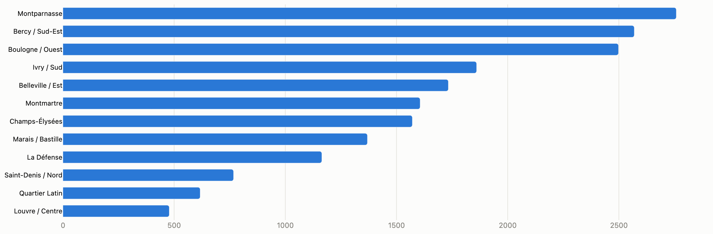
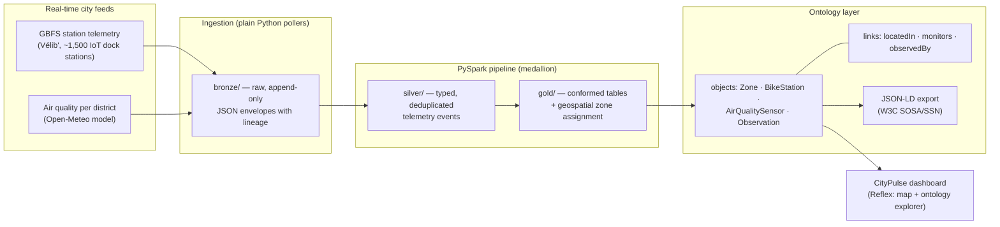

# CityPulse — a smart-city data platform with a live ontology

Real-time IoT telemetry from Paris (1,500+ Vélib' bike-share dock stations +
per-district air quality), ingested into a medallion lakehouse, transformed
with **PySpark**, and materialized into a **city ontology** — typed objects,
properties and links derived entirely from the ingested data — explorable
through a live **Reflex** dashboard.

The architecture deliberately mirrors how enterprise smart-city platforms
(e.g. Palantir Foundry) are built: lightweight connectors land raw data,
Spark pipelines refine it, and an ontology layer turns tables into a semantic
graph that applications query.






## Why an ontology, and why derived?

A smart city integrates dozens of heterogeneous feeds. Tables answer "what
rows exist"; an ontology answers "**what things exist and how they relate**":
*this station is in this district, which is monitored by this sensor, whose
last observation says the air is Fair.* The key design decision here is that
the graph is **never hand-maintained** — `schema.yml` declares the model
(object types, properties, link types), and a build step hydrates it from the
gold datasets. Re-run the pipeline and the ontology updates itself. The
vocabulary maps onto the W3C **SOSA/SSN** standard (`sosa:Sensor`,
`sosa:Observation`, `sosa:FeatureOfInterest`), the basis of NGSI-LD and
SAREF4City used by real smart-city platforms, and the graph exports to
JSON-LD (`data/ontology/city_graph.jsonld`).

## Architecture decisions worth asking me about

- **Why not Spark for ingestion?** Ingestion is I/O-bound (polling REST
  feeds), so it's plain Python; Spark enters where it earns its keep — the
  transform layer. This mirrors production platforms, where connectors land
  data and Spark pipelines refine it.
- **Bronze is append-only.** Raw payloads are landed verbatim in envelopes
  (`feed`, `polled_at`, `source_url`, `payload`) so lineage survives upstream
  schema changes, and every downstream table can be rebuilt from scratch.
- **Deduplication is semantic.** A station re-polled before it re-reports is
  the *same* telemetry event: silver dedups on `(station_id, last_reported)`,
  not on poll time.
- **Zone assignment is a pipeline concern, not a dashboard concern.**
  Stations are joined to their nearest district center with a pure-column
  haversine (no UDF) in the gold transform, so the ontology link
  `locatedIn` is already materialized when the graph is built.

## Run it

```bash
python3 -m venv .venv && .venv/bin/pip install -r requirements.txt

# 1. collect live telemetry (leave running; every 60s)
PYTHONPATH=src .venv/bin/python -m smartcity.ingest.runner --loop 60

# 2. run the PySpark pipeline (any time, incremental by re-run)
PYTHONPATH=src .venv/bin/python -m smartcity.pipeline.bronze_to_silver
PYTHONPATH=src .venv/bin/python -m smartcity.pipeline.silver_to_gold

# 3. hydrate the ontology + standards export
PYTHONPATH=src .venv/bin/python -m smartcity.ontology.build
PYTHONPATH=src .venv/bin/python -m smartcity.ontology.export_jsonld

# 4. dashboard
cd dashboard && ../.venv/bin/reflex run        # http://localhost:3000
```

Or query the graph directly:

```python
from smartcity.ontology.query import Ontology
onto = Ontology.load()
onto.zone_context("zone:montmartre")
# {'zone': {...}, 'n_stations': 183, 'bikes_available': 1630,
#  'sensor': {'eaqi': 47.0, 'pm2_5': 11.6, ...}}
```

## Layout

```
config/city.yml              city, feeds, district zones (the spatial model)
src/smartcity/ingest/        pollers → bronze (append-only raw)
src/smartcity/pipeline/      PySpark: bronze→silver→gold
src/smartcity/ontology/      schema.yml, hydration, query API, JSON-LD export
dashboard/                   Reflex app: live map + ontology explorer
data/                        bronze/ silver/ gold/ ontology/ (generated)
```

Feeds: [GBFS](https://github.com/MobilityData/gbfs) (open standard, 1,500+
cities) and [Open-Meteo air quality](https://open-meteo.com/) — both free, no
API keys.
