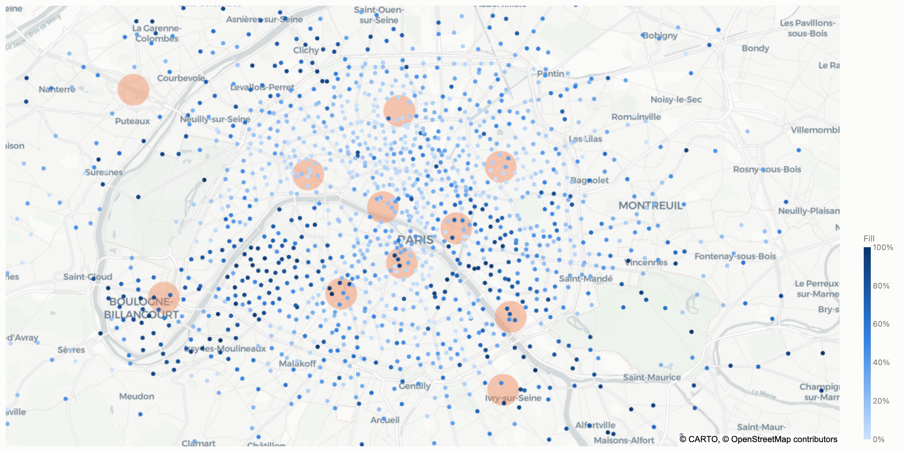
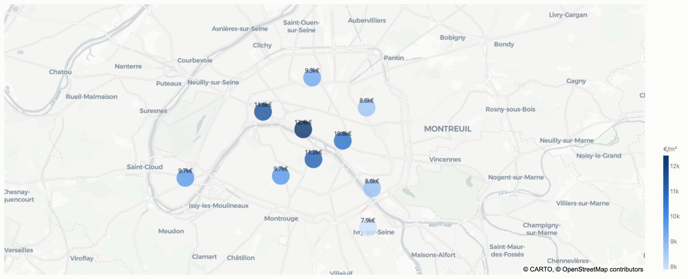
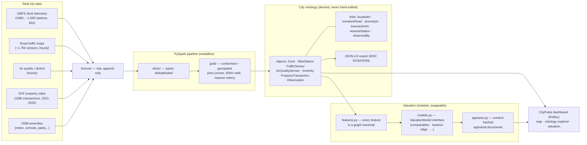

# CityPulse — a smart-city data platform with a live ontology and property valuation

Five real Paris data sources — 1,500+ Vélib' bike-dock IoT stations, 1,750+
road-traffic induction loops, per-district air quality, 158,000+ official
property transactions (DVF), and 4,500 OpenStreetMap amenities — ingested
into a medallion lakehouse, transformed with **PySpark**, materialized into a
**city ontology** (typed objects, properties and links derived entirely from
the ingested data), and put to work: an **explainable property-valuation
engine** whose every feature is a traversal of that graph, served by a live
**Reflex** dashboard.

The architecture deliberately mirrors how enterprise smart-city platforms
(e.g. Palantir Foundry) are built: lightweight connectors land raw data,
Spark pipelines refine it, an ontology layer turns tables into a semantic
graph, and applications — here, valuation — consume the graph.







## Why an ontology, and why derived?

A smart city integrates heterogeneous feeds. Tables answer "what rows
exist"; an ontology answers "**what things exist and how they relate**":
*this apartment sale sits in this district, 370m from this metro station,
monitored by these road sensors, whose last readings say traffic is fluid
and the air is Fair.* The key design decision: the graph is **never
hand-maintained** — `src/smartcity/ontology/schema.yml` declares the model,
and a build step hydrates ~166,000 objects and ~320,000 links from the gold
datasets. Re-run the pipeline and the ontology updates itself. The sensing
vocabulary maps onto W3C **SOSA/SSN** (the basis of NGSI-LD and SAREF4City),
and the whole graph exports to JSON-LD.

## Ontology-driven valuation (explainable by construction)

`src/smartcity/valuation/` prices any property in Paris from the graph:

- **`features.py` owns the feature contract** — zone comparables, distance
  to the nearest metro (`nearestStation` link), amenity counts within 500m,
  road-traffic occupancy and air quality of the zone. Every feature is a
  traversal, so every estimate is traceable to edges in the graph.
- **`models.py` isolates the ML** behind one `ValuationModel` interface
  (fit / predict / explain / save / load) with a registry. Today: a
  comparables baseline and a hedonic ridge regression (log €/m², zone and
  property-type effects). Swapping in gradient boosting, a GNN over the
  ontology, or an external oracle is one class + one registry entry —
  nothing else changes.
- **Honest evaluation**: time-based split — trained on 127k sales ≤2024,
  tested on 31k unseen 2025 sales. Hedonic ridge: median absolute error
  **16.0%** (comparables baseline: 17.0%). DVF carries no floor, condition
  or build year, which bounds what any model can do here.
- **`appraise.py` emits versioned, content-hashed appraisal documents**
  (inputs, graph features, estimate, per-driver breakdown, model manifest,
  sha256) — see the tokenization roadmap below.

## Roadmap: property tokenization (designed-for, not yet built)

The next layer is a tokenized property-trading platform on a local
blockchain. The current architecture already leaves the seams:

- **Stable asset identity**: `PropertyTransaction` ids derive from official
  mutation + parcel ids, so a future `Asset`/`PropertyToken` object type
  (reserved in `schema.yml`) can reference them without re-keying.
- **Oracle-ready appraisals**: appraisal documents are canonical JSON with a
  sha256 self-hash — exactly the tamper-evident payload a smart contract
  anchors when minting or repricing a token.
- **Model provenance**: every artifact ships a manifest (features, metrics,
  training-data fingerprint), so an on-chain valuation can state *which*
  model produced it.

## Architecture decisions worth asking me about

- **Why not Spark for ingestion?** Ingestion is I/O-bound polling; Spark
  enters where it earns its keep — transforms over 27M-row feeds and 158k
  geolocated sales (grid-cell radius joins, no UDFs).
- **Bronze is append-only.** Raw payloads land verbatim with lineage
  envelopes; every downstream table can be rebuilt from scratch.
- **Deduplication is semantic.** A station re-polled before it re-reports is
  the same event: silver dedups on `(entity, reported-time)`, not poll time.
- **Geospatial joins live in the pipeline, not the app.** Zone assignment,
  nearest-metro and 500m amenity counts are computed once in gold, so the
  ontology links and the valuation features are the same artifact.

## Run it

```bash
python3 -m venv .venv && .venv/bin/pip install -r requirements.txt

# 1. live collectors (leave running) + batch ingests (once)
PYTHONPATH=src .venv/bin/python -m smartcity.ingest.runner --loop 60
PYTHONPATH=src .venv/bin/python -m smartcity.ingest.traffic --hours 168
PYTHONPATH=src .venv/bin/python -m smartcity.ingest.dvf
PYTHONPATH=src .venv/bin/python -m smartcity.ingest.amenities

# 2. PySpark pipeline
PYTHONPATH=src .venv/bin/python -m smartcity.pipeline.bronze_to_silver
PYTHONPATH=src .venv/bin/python -m smartcity.pipeline.silver_to_gold

# 3. ontology + standards export
PYTHONPATH=src .venv/bin/python -m smartcity.ontology.build
PYTHONPATH=src .venv/bin/python -m smartcity.ontology.export_jsonld

# 4. valuation
PYTHONPATH=src .venv/bin/python -m smartcity.valuation.train
PYTHONPATH=src .venv/bin/python -m smartcity.valuation.appraise \
    --lat 48.8846 --lon 2.3382 --surface 62 --rooms 3 --type Appartement

# 5. dashboard
cd dashboard && ../.venv/bin/reflex run        # http://localhost:3000
```

Or straight from the graph:

```python
from smartcity.ontology.query import Ontology
onto = Ontology.load()
onto.zone_context("zone:montmartre")
# {'n_stations': 183, 'n_road_sensors': 187, 'n_amenities': 550,
#  'n_recent_sales': 11527, 'median_price_m2': 9357.0, ...}
```

## Layout

```
config/city.yml              city, feeds, district zones (the spatial model)
src/smartcity/ingest/        pollers + batch ingests → bronze (append-only)
src/smartcity/pipeline/      PySpark: bronze→silver→gold (incl. geospatial joins)
src/smartcity/ontology/      schema.yml, hydration, query API, JSON-LD export
src/smartcity/valuation/     feature contract, swappable models, appraisals
dashboard/                   Reflex app: map · ontology explorer · valuation
data/                        bronze/ silver/ gold/ ontology/ valuation/ (generated)
```

Sources: [GBFS](https://github.com/MobilityData/gbfs) ·
[Paris road counters](https://opendata.paris.fr/explore/dataset/comptages-routiers-permanents/) ·
[Open-Meteo](https://open-meteo.com/) ·
[DVF géolocalisé (Etalab)](https://files.data.gouv.fr/geo-dvf/) ·
[OpenStreetMap/Overpass](https://overpass-api.de/) — all free, no API keys.
